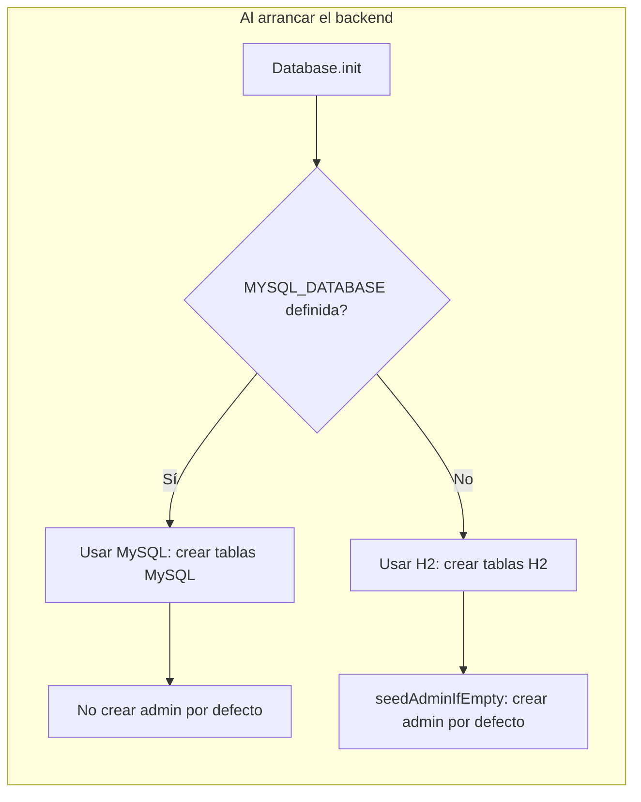
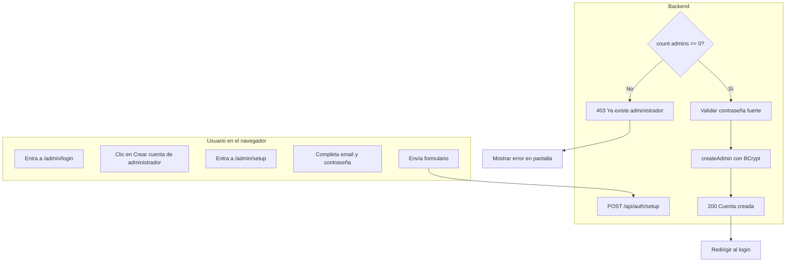

# Documentación detallada: cambios y pasos MySQL/Admin

**No hay email ni contraseña por defecto.** La primera vez tenés que crear tu cuenta desde el navegador en **/admin/setup**.

Para que el proyecto funcione solo necesitás:
- **MySQL** corriendo (si usás MySQL; si no, se usa H2 en archivo)
- **Backend** corriendo en NetBeans
- **Frontend** con `npm run dev`

Luego entrá a **http://localhost:5173/admin/setup**, creá tu cuenta y usá ese correo y contraseña para iniciar sesión.

---

Este documento describe los cambios realizados y los pasos detallados para configurar MySQL y el admin.

---

## 1. Resumen de los cambios realizados

### 1.1 Backend (Java / Tomcat)

| Archivo | Cambio |
|--------|--------|
| `backend-tomcat/pom.xml` | Se agregó la dependencia **mysql-connector-j** (versión 8.2.0) para conectar a MySQL. H2 se mantiene. |
| `backend-tomcat/src/main/java/com/inmobiliaria/api/repository/Database.java` | **Soporte dual H2 / MySQL:** si existe la variable de entorno `MYSQL_DATABASE`, se usa el driver MySQL y la URL se arma con `MYSQL_HOST`, `MYSQL_PORT`, `MYSQL_USER`, `MYSQL_PASSWORD`. Se añadieron `dbUser` y `dbPassword` (ya no están fijos "sa" y ""). Nuevo método `isUsingMysql()`. **DDL separado:** `createTablesMysql()` (sintaxis MySQL: `auto_increment`, `text` en lugar de `clob`) y `createTablesH2()` (igual que antes). **Seed de admin:** `seedAdminIfEmpty()` solo se ejecuta cuando **no** se usa MySQL (`if (!useMysql)`); con MySQL no se crea ningún admin por defecto. |
| `backend-tomcat/src/main/java/com/inmobiliaria/api/repository/PropertyRepository.java` | En la búsqueda por ubicación se reemplazó `coalesce(location,'') \|\| ' ' \|\| coalesce(city,'')` por `concat(coalesce(location,''),' ',coalesce(city,''))` para compatibilidad con MySQL (y H2). |
| `backend-tomcat/src/main/java/com/inmobiliaria/api/servlet/AuthSetupServlet.java` | **Nuevo servlet** mapeado a `/api/auth/setup`. **GET:** devuelve `{ "setupRequired": true/false }` según si hay o no administradores en `admin_users`. **POST:** recibe `{ "email", "password" }`, valida reglas de contraseña con `PasswordStrengthUtil`, comprueba que no exista ningún admin (`count() == 0`); si ya hay admin responde 403; si no, crea el primer admin con BCrypt y responde 200 con mensaje de éxito. |
| `backend-tomcat/README.md` | Se amplió la sección **Base de datos** con subsecciones **H2 (por defecto)** y **MySQL**, explicando variables de entorno, que con MySQL no se crea admin por defecto y que la primera cuenta se crea desde `/admin/setup`. |

### 1.2 Frontend (Vue)

| Archivo | Cambio |
|--------|--------|
| `src/router/index.js` | Nueva ruta **`/admin/setup`** (nombre `AdminSetup`) que carga `AdminSetupPage.vue`, con `meta: { requiresGuest: true }`. |
| `src/views/admin/AdminLoginPage.vue` | Se agregó un enlace debajo de "¿Olvidaste tu contraseña?": **"¿Primera vez? Crear cuenta de administrador"** que apunta a `/admin/setup`. |
| `src/views/admin/AdminSetupPage.vue` | **Nueva vista:** formulario para crear la primera cuenta de administrador. Campos: email, contraseña, confirmar contraseña. Validación en frontend: mínimo 8 caracteres, una mayúscula, un número y un símbolo; contraseñas deben coincidir. Envía POST a `{VITE_API_URL}/auth/setup`. Muestra errores del backend. Tras éxito redirige al login tras 1,5 s. Enlace "Volver al login". |

### 1.3 Flujo de decisión (base de datos y admin)

**Al arrancar el backend:**



**Crear cuenta desde el navegador:**



---

## 2. Pasos detallados: MySQL y cuenta de administrador

### 2.1 Requisitos previos

- **MySQL** instalado y en ejecución (XAMPP, MAMP, MySQL Server, etc.).
- **NetBeans** con el proyecto **backend-tomcat** abierto.
- **Node.js** instalado para el frontend Vue.

### 2.2 Configurar variables de entorno para MySQL

1. En NetBeans, abrí **solo** la carpeta **backend-tomcat** (no la raíz del repo).
2. Clic derecho en el proyecto (ej. **inmobiliaria-api**) → **Properties**.
3. En el panel izquierdo, **Run**.
4. Buscá la sección donde se definen **variables de entorno** (puede llamarse "Environment", "VM Options" o estar en la pestaña del servidor).
5. Agregá estas variables (ajustando valores a tu MySQL):

   | Variable | Valor | Obligatorio |
   |----------|--------|-------------|
   | `MYSQL_DATABASE` | `inmobiliaria` (o el nombre de base que quieras) | Sí (activa MySQL) |
   | `MYSQL_USER` | Usuario MySQL (ej. `root`) | No (por defecto `root`) |
   | `MYSQL_PASSWORD` | Contraseña de ese usuario | No (vacío por defecto) |
   | `MYSQL_HOST` | `localhost` | No |
   | `MYSQL_PORT` | `3306` | No |

6. Guardá con **OK**.

**Nota:** si la base `inmobiliaria` no existe, el backend puede crearla al arrancar gracias a `createDatabaseIfNotExist=true` en la URL (si el usuario tiene permisos).

### 2.3 Arrancar el backend

1. En NetBeans: **Run** (o F6) del proyecto backend.
2. Esperá a que en la pestaña **Output** aparezca que Tomcat está corriendo (puerto 8080).
3. Si ves un error tipo "No se pudo cargar el driver MySQL", verificá que en `backend-tomcat/pom.xml` esté la dependencia `mysql-connector-j` y que hayas hecho **Clean and Build**.

### 2.4 Arrancar el frontend

1. En una terminal, entrá a la **raíz del proyecto** (carpeta `inmobiliaria`, donde está el frontend):
   ```bash
   cd /Users/micaelamargaritamattiucci/Documents/inmobiliaria
   ```
2. Ejecutá:
   ```bash
   npm run dev
   ```
3. Dejá la terminal abierta; el frontend quedará en **http://localhost:5173**.

### 2.5 Crear la primera cuenta de administrador (desde el navegador)

1. Abrí el navegador y entrá a **http://localhost:5173**.
2. Andá a la sección **Admin** (o a **http://localhost:5173/admin/login**).
3. En la pantalla de login, hacé clic en **"¿Primera vez? Crear cuenta de administrador"** (o entrá directo a **http://localhost:5173/admin/setup**).
4. En **Crear cuenta de administrador**:
   - **Email:** el que vas a usar siempre para entrar (ej. `tuemail@gmail.com`).
   - **Contraseña:** mínimo 8 caracteres, al menos una mayúscula, un número y un símbolo (ej. `MiClave123!`).
   - **Confirmar contraseña:** la misma.
5. Clic en **Crear cuenta**.
6. Si todo está bien, verás un mensaje de éxito y serás redirigido al login. Si ya existía un administrador, verás el error "Ya existe un administrador. Usá la pantalla de login."

### 2.6 Iniciar sesión

1. En la pantalla de **login** del admin ingresá el **email** y la **contraseña** que usaste en el paso anterior.
2. Clic en **Entrar**. Deberías entrar al panel de administrador.

### 2.7 Ver los datos en MySQL (opcional)

- Si tenés **phpMyAdmin** (por ejemplo con XAMPP): abrilo en el navegador, elegí la base `inmobiliaria` y revisá las tablas: `admin_users`, `properties`, `property_images`, `password_reset_tokens`, `login_attempts`. La contraseña en `admin_users` está hasheada con BCrypt.
- Con cualquier cliente MySQL (DBeaver, MySQL Workbench, etc.) conectate a la misma base usando el mismo usuario y contraseña que configuraste en las variables de entorno.

### 2.8 Cambiar o crear admin desde MySQL / phpMyAdmin

La contraseña en `admin_users` se guarda como **hash BCrypt**, no en texto plano. Para poner una contraseña nueva desde phpMyAdmin necesitás generar ese hash con la misma herramienta que usa el backend.

**Paso 1 – Generar el hash de tu contraseña**

En una terminal, desde la carpeta **backend-tomcat**:

```bash
cd /Users/micaelamargaritamattiucci/Documents/inmobiliaria/backend-tomcat
mvn -q exec:java -Dexec.args="TuContraseña123!"
```

(Reemplazá `TuContraseña123!` por la contraseña que quieras; debe cumplir: mínimo 8 caracteres, una mayúscula, un número y un símbolo.)

La consola imprime **una sola línea** (el hash). Copiala completa (empieza con `$2a$10$` o similar).

**Paso 2 – Actualizar en phpMyAdmin (cambiar contraseña de un admin existente)**

1. Abrí phpMyAdmin, base `inmobiliaria`, tabla `admin_users`.
2. Clic en **Editar** (o SQL) para el usuario cuyo email querés usar para entrar.
3. En la columna **password_hash** pegá el hash que copiaste.
4. Guardá.

**Paso 2 alternativo – Crear un admin nuevo desde SQL**

En la pestaña **SQL** de phpMyAdmin ejecutá (reemplazá el email y el hash):

```sql
INSERT INTO admin_users (email, password_hash, created_at)
VALUES ('tu@email.com', 'EL_HASH_QUE_COPIASTE_DEL_PASO_1', '2026-03-09T00:00:00Z');
```

**Paso 3 – Iniciar sesión**

En la web, entrá al login del admin con ese **email** y la **contraseña** que usaste en el Paso 1.

---

## 3. Si aparece error de CORS al crear cuenta o al hacer login

El mensaje suele ser: *"Access to fetch at 'http://localhost:8080/api/...' from origin 'http://localhost:5173' has been blocked by CORS policy"*. Eso suele indicar que la petición **no está llegando a tu aplicación** (por ejemplo 404), y la respuesta sin cabeceras CORS la bloquea el navegador. Seguí estos pasos:

### Paso 1: Confirmar que el backend está corriendo

1. En NetBeans, ejecutá el proyecto backend (Run / F6) y esperá a que Tomcat arranque.
2. En el navegador abrí: **http://localhost:8080/api/auth/setup**  
   - Si ves un JSON (por ejemplo `{"setupRequired":true}` o `{"setupRequired":false}`), el backend está bien y la API está en la **raíz** (`/`). Pasá al **Paso 3**.
   - Si ves **404** o **Connection refused**, seguí con el Paso 2.

### Paso 2: Verificar la ruta de la API (context path)

En NetBeans, el WAR suele desplegarse con un **context path** (ej. `/inmobiliaria-api`). En ese caso la API no está en `http://localhost:8080/api` sino en `http://localhost:8080/inmobiliaria-api/api`.

1. Probá en el navegador: **http://localhost:8080/inmobiliaria-api/api/auth/setup**  
   - Si ahí sí ves un JSON, tu API está bajo `/inmobiliaria-api`.
2. En la **raíz del proyecto** (carpeta `inmobiliaria`), editá el archivo **`.env`** y poné:
   ```bash
   VITE_API_URL=http://localhost:8080/inmobiliaria-api/api
   ```
3. Guardá, **pará** el frontend (`Ctrl+C` en la terminal donde corre `npm run dev`) y volvé a ejecutar:
   ```bash
   npm run dev
   ```
4. Intentá de nuevo crear la cuenta en **http://localhost:5173/admin/setup**.

### Paso 3: Si la API está en la raíz y sigue el error CORS

1. En NetBeans: **Clean and Build** del proyecto backend y volvé a **Run**.
2. Asegurate de que en el navegador **http://localhost:8080/api/auth/setup** responda con JSON (no 404).
3. Recargá la página de crear cuenta (F5) e intentá de nuevo.

---

Este archivo está en la raíz del proyecto (`PASOS-MYSQL-ADMIN.md`).
